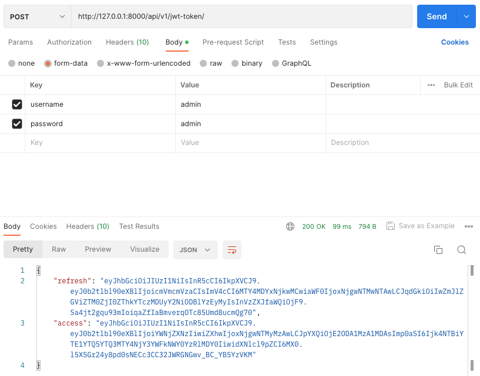
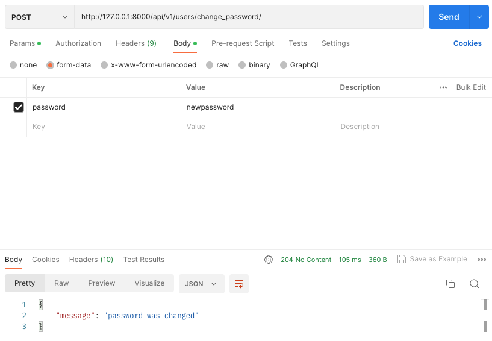
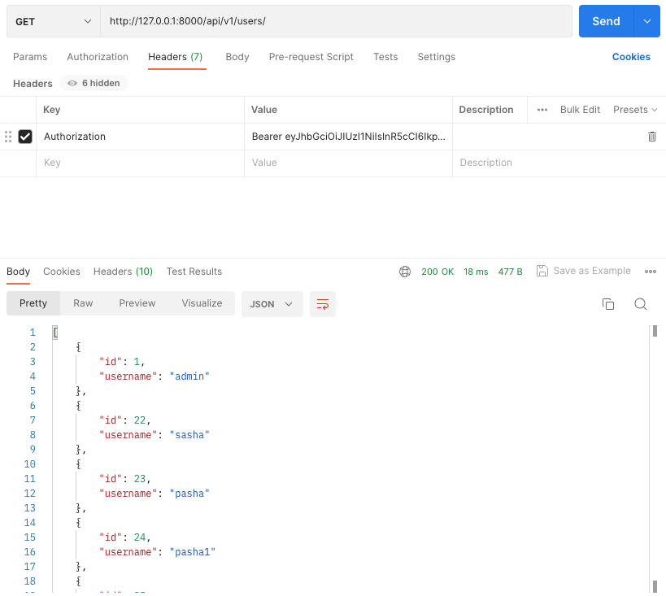
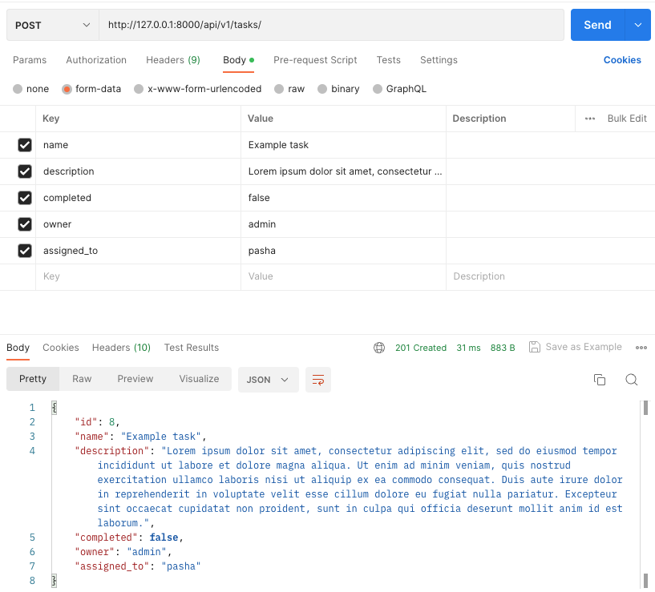
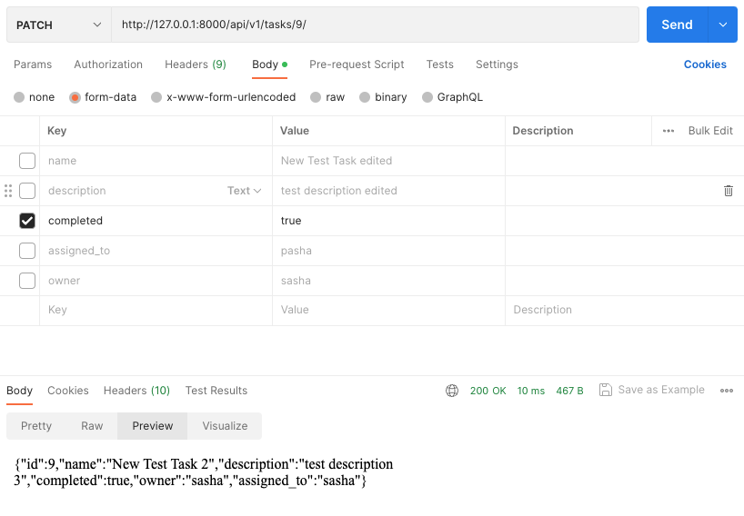
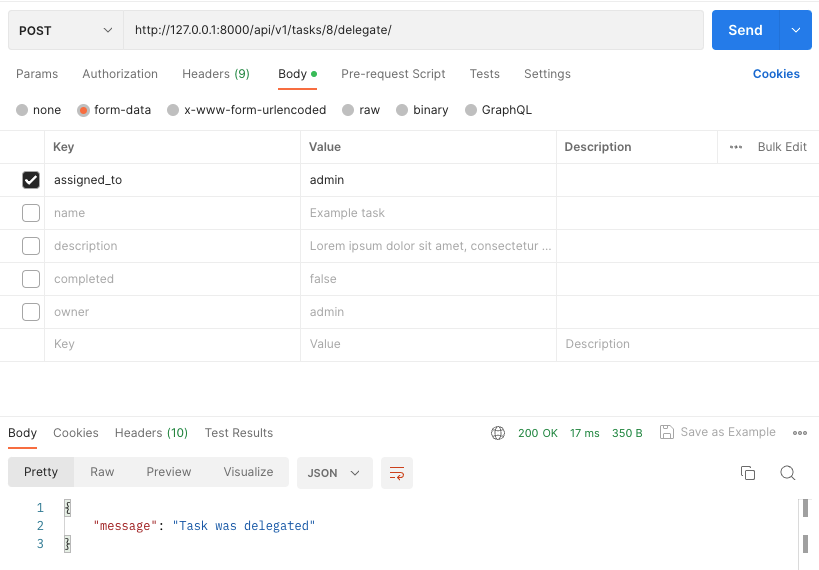
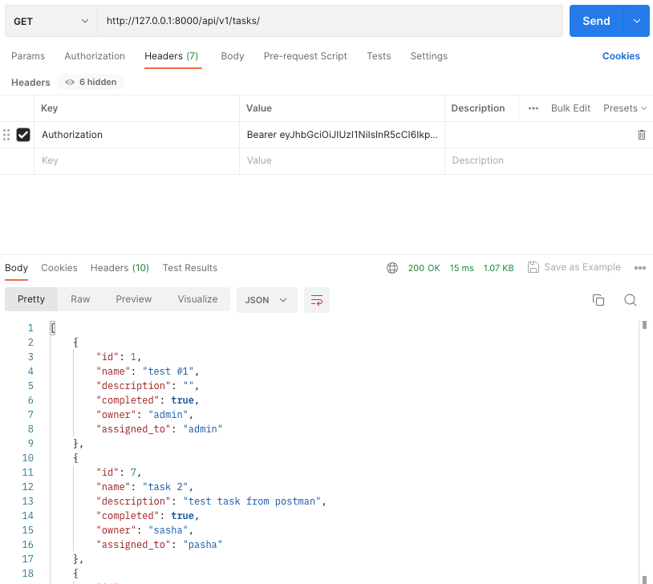

# Task Tracker
This is a simple task tracker application built with Django Rest Framework (DRF) and JWT authentication.

## API Endpoints
The following API endpoints are available:

### Authentication
`POST /api/v1/jwt-token/` - obtain a JWT token by providing username and password.
<br>`POST /api/v1/jwt-token/refresh/` - obtain a new JWT token by providing a refresh token. 
<br>`POST /api/v1/jwt-token/verify/` - verify the authenticity of a JWT token.

### Tasks
`GET /api/v1/tasks/` - retrieve all tasks (any authenticated user).
<br>`POST /api/v1/tasks/` - create a new task (any authenticated user).
<br>`GET /api/v1/tasks/{id}/` - retrieve information about a specific task by ID (any authenticated user).
<br>`PUT /api/v1/tasks/{id}/` - update task information (only owner or assignee).
<br>`PATCH /api/v1/tasks/{id}/` - partially update task information (only owner or assignee).
<br>`DELETE /api/v1/tasks/{id}/ `- delete a task (only owner).
<br>`POST /api/v1/tasks/{id}/complete/` - mark a task as completed (only owner or assignee).
<br>`POST /api/v1/tasks/{id}/incomplete/` - mark a task as incomplete (only owner or assignee).
<br>`POST /api/v1/tasks/{id}/delegate/` - delegate a task to another user (only owner or assignee).

### Users
`GET /api/v1/users/` - retrieve all users (any authenticated user).
<br>`GET /api/v1/users/{id}/` - retrieve information about a specific user by ID (any authenticated user).
<br>`POST /api/v1/users/` - create a new user (anyone).
<br>`DELETE /api/v1/users/{id}/` - delete a user (only admin or the user himself).
<br>`POST /api/v1/users/change_password/` - change a user's password (any authenticated user).

## Installation

To run this application locally, follow these steps:

Clone this repository:
```
git clone https://github.com/razzzzzr/task_tracker
```
Create a virtual environment and install the project dependencies:
```
cd task_tracker
python3 -m venv venv
source venv/bin/activate  # for Unix/Linux
env\Scripts\activate  # for Windows
pip install -r requirements.txt
```
Create config file:
```
cd task_tracker
cp config.example.yaml config.yaml
```
Set up the database:
```
python manage.py migrate
```
Create a superuser account to access the admin panel:
```
python manage.py createsuperuser
```
Run the development server:
```
python manage.py runserver
```
The server will be available at http://127.0.0.1:8000/.


## Usage
You can use the API endpoints mentioned above to create and manage tasks and users.
Before accessing the authenticated endpoints, you need to obtain a JWT token by sending a POST request to `/api/v1/jwt-token/` with your username and password in the request body. You can then include the token in the Authorization header of subsequent requests.

For example:
`Authorization: Bearer <your-token-here>`

## Some examples via Postman
### Authorization
Get JWT tokens


Create new user


Change password


Show all users


Create new task


Mark the task completed (body is empty)


Delegate the task to another user


Show all tasks
